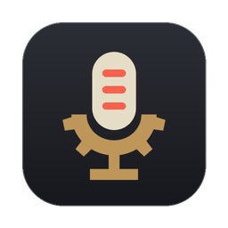
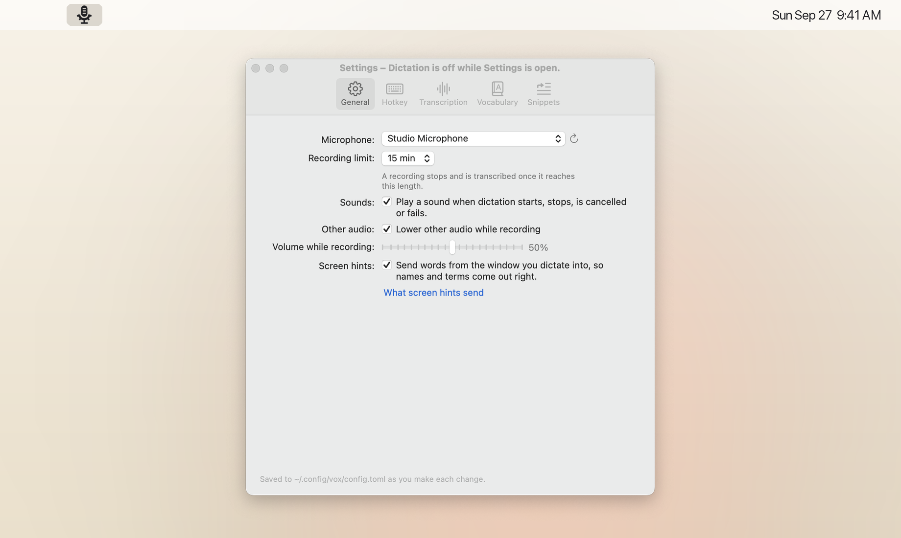
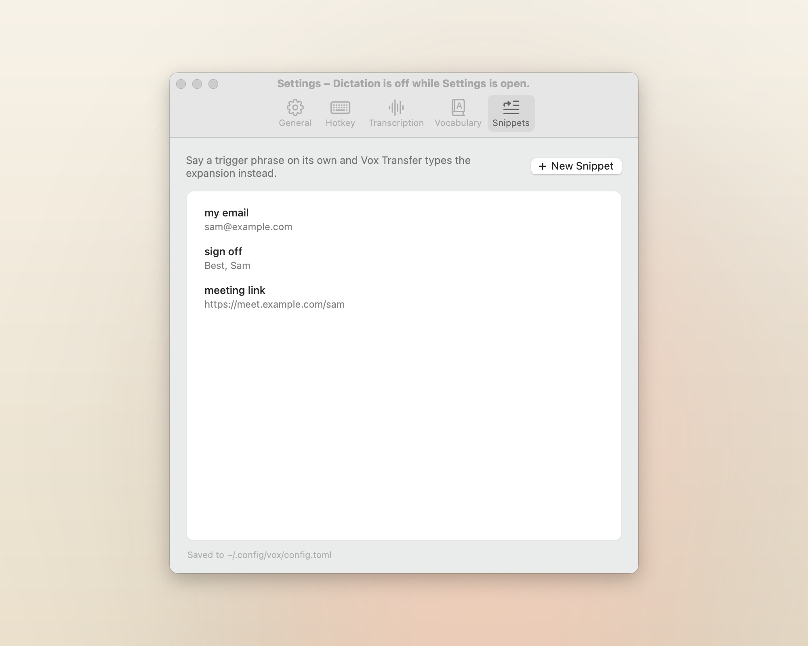
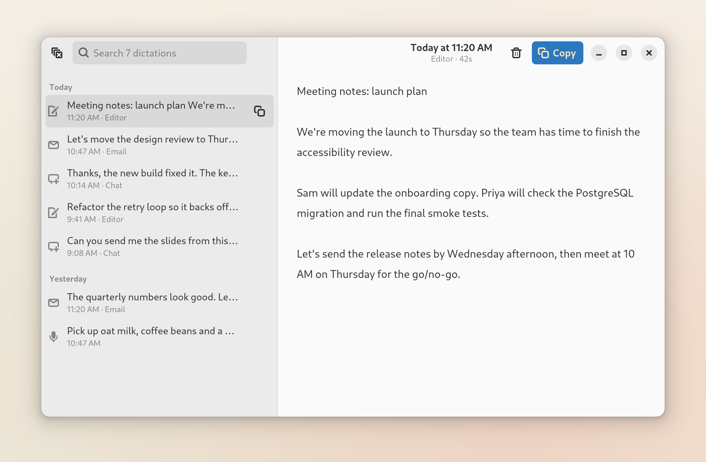

<p align="center">
  
</p>

<h1 align="center">Vox Transfer</h1>

<p align="center">
  <b>Talk instead of type, in any app.</b><br>
  Tap a key, speak, and tap it again. Your words appear wherever you were typing.
</p>

<p align="center">
  <a href="https://github.com/runsonmypc/vox/releases/latest"></a>
  
  <a href="LICENSE"></a>
</p>

<picture>
  <source media="(prefers-color-scheme: dark)" srcset="docs/images/hero-dark.png">
  
</picture>

## How it works

1. **Tap right Shift** and start talking.
2. **Tap it again.** Vox Transfer types what you said into the app you're in.
3. Changed your mind? **Double-tap** to cancel.

Shift still types capitals: only a tap on its own starts dictation. It works in email, chat,
documents, code editors and terminals.

Vox Transfer runs in the background, with a microphone icon in the menu bar (macOS) or the system
tray (Linux). Everything else is in its menu and its Settings window, from choosing another hotkey to
searching what you've dictated.

## Install

On macOS or Linux, run:

```sh
curl -fsSL https://github.com/runsonmypc/vox/releases/latest/download/install.sh | bash
```

- **macOS** needs [uv](https://docs.astral.sh/uv/) first: `brew install uv`. When macOS asks, allow
  Microphone, Accessibility and Input Monitoring, then quit Vox Transfer from its menu and open it
  again from Applications. Screen Recording is optional: it lets Vox Transfer read names on your
  screen so it spells them right.
- **Linux** needs Ubuntu 24.04 or similar, in an X11 session: at the login screen, choose
  **Ubuntu on Xorg**. The installer asks for your password to add a few system packages. There's
  also a `.deb` on the [releases page](https://github.com/runsonmypc/vox/releases/latest).

Vox Transfer then asks for an OpenAI API key, which you can create at
[platform.openai.com/api-keys](https://platform.openai.com/api-keys) (OpenAI bills API use
separately from ChatGPT). Rather not? It can also
[transcribe on your own computer](docs/settings.md#local-transcription-with-whispercpp), for free.

Run the same command again to update. [More install options](docs/install.md)

### Or let your AI assistant set it up

Using Claude Code, Codex, Cursor or another AI coding assistant? Paste this in:

```text
Install Vox Transfer for me by following https://github.com/runsonmypc/vox/blob/main/docs/ai-setup.md
Then ask me what I'd like to customize (hotkey, vocabulary, snippets, language, offline
transcription) and set it up.
```

## What you get

- **Works wherever you type.** It pastes into the app you're in, then puts your clipboard back.
- **OpenAI or fully offline.** Transcribe with OpenAI, or locally with whisper.cpp. Switch in
  Settings.
- **Spells your words right.** Add names and jargon to your vocabulary.
- **Snippets.** Say "my email" and get your email address.
- **Searchable history** of everything you've dictated, kept on your computer.
- **Private.** No analytics and no telemetry. [What leaves your computer](docs/privacy.md)

<table>
  <tr>
    <td width="50%">
      <picture>
        <source media="(prefers-color-scheme: dark)" srcset="docs/images/snippets-dark.png">
        
      </picture>
    </td>
    <td width="50%">
      <picture>
        <source media="(prefers-color-scheme: dark)" srcset="docs/images/history-linux-dark.png">
        
      </picture>
    </td>
  </tr>
  <tr>
    <td align="center">Snippets in Settings on macOS</td>
    <td align="center">History on Linux</td>
  </tr>
</table>

## Learn more

- [Install](docs/install.md): other ways to install, permissions, updating and uninstalling
- [Using Vox Transfer](docs/using.md): the hotkey, the menu, Settings and long recordings
- [Settings](docs/settings.md): every option, sounds, and offline transcription
- [Privacy](docs/privacy.md): what is sent and what stays on your computer
- [Troubleshooting](docs/troubleshooting.md)
- [Development](docs/development.md)

## License

Copyright (C) 2026 Alex. Vox Transfer is free software: you can redistribute it and change it under
the terms of the [GNU General Public License, version 3](LICENSE). It comes with no warranty; see
[LICENSE](LICENSE) for the full terms.
