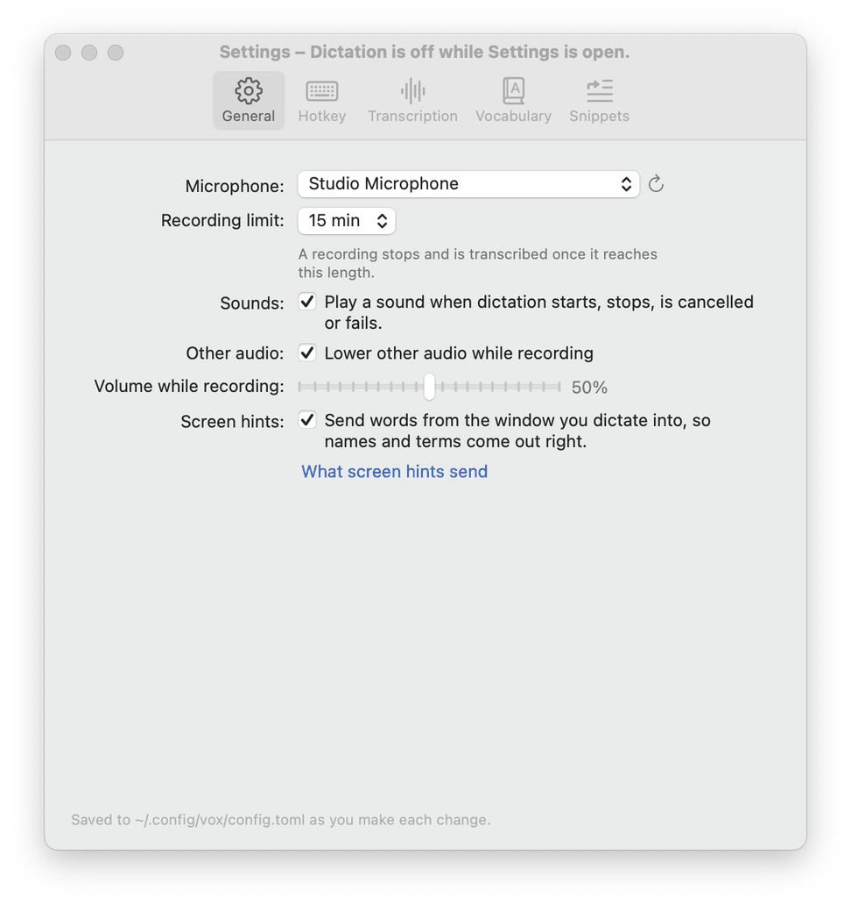
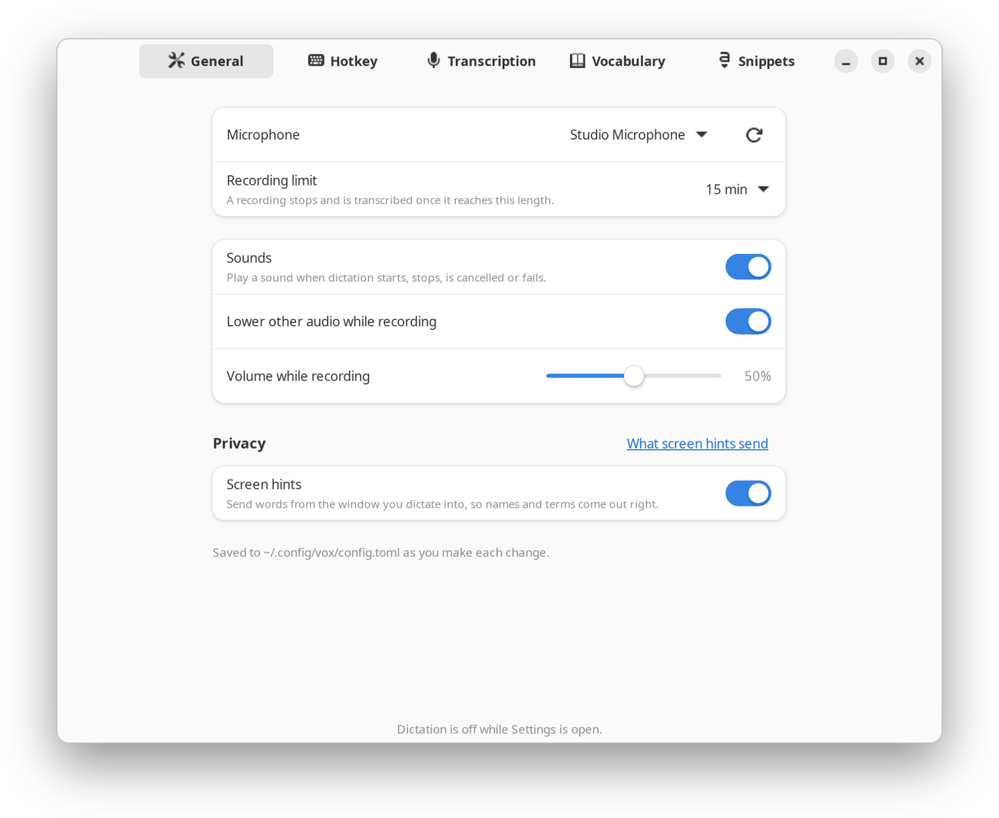
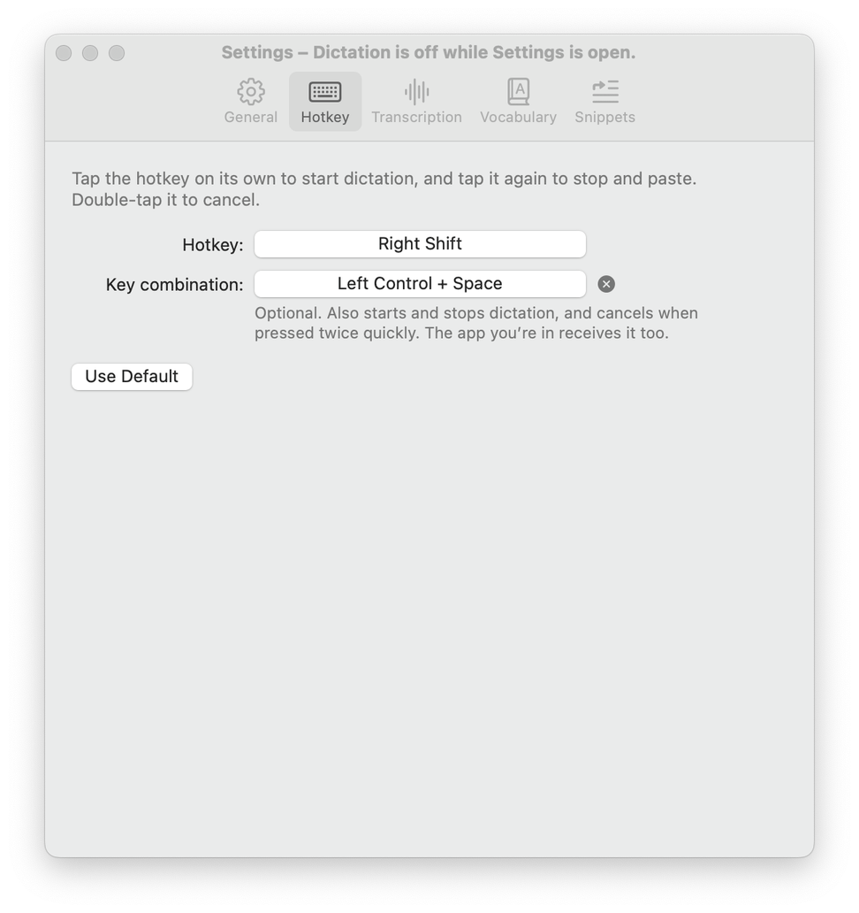
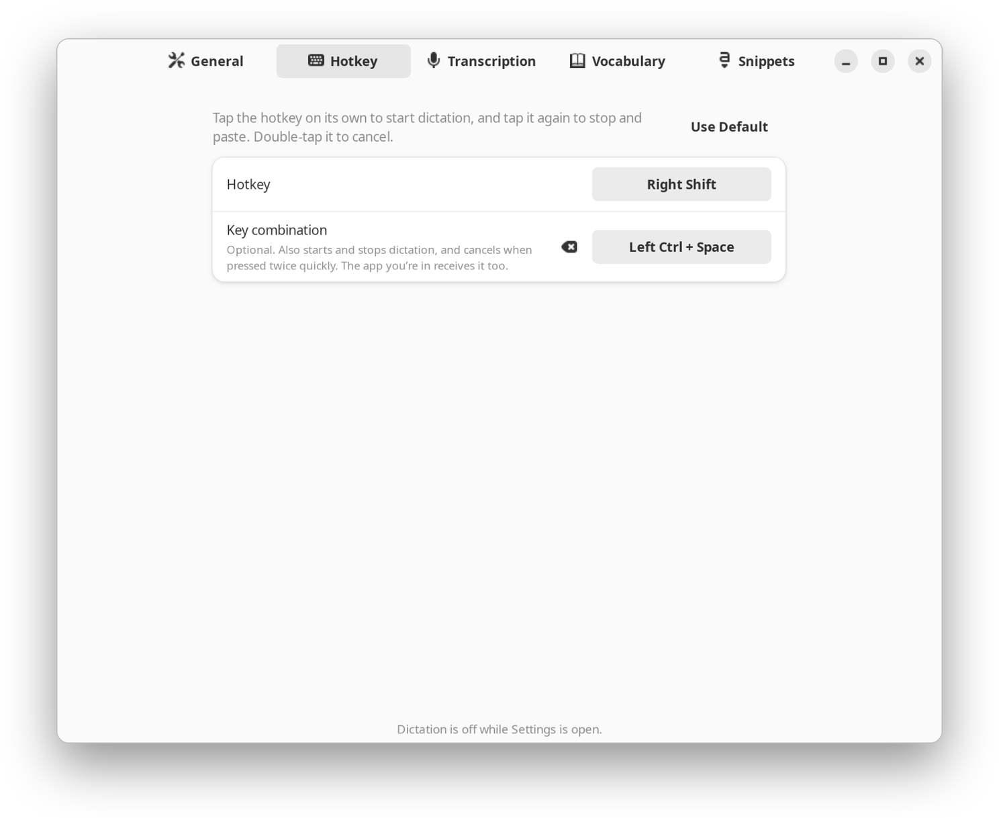
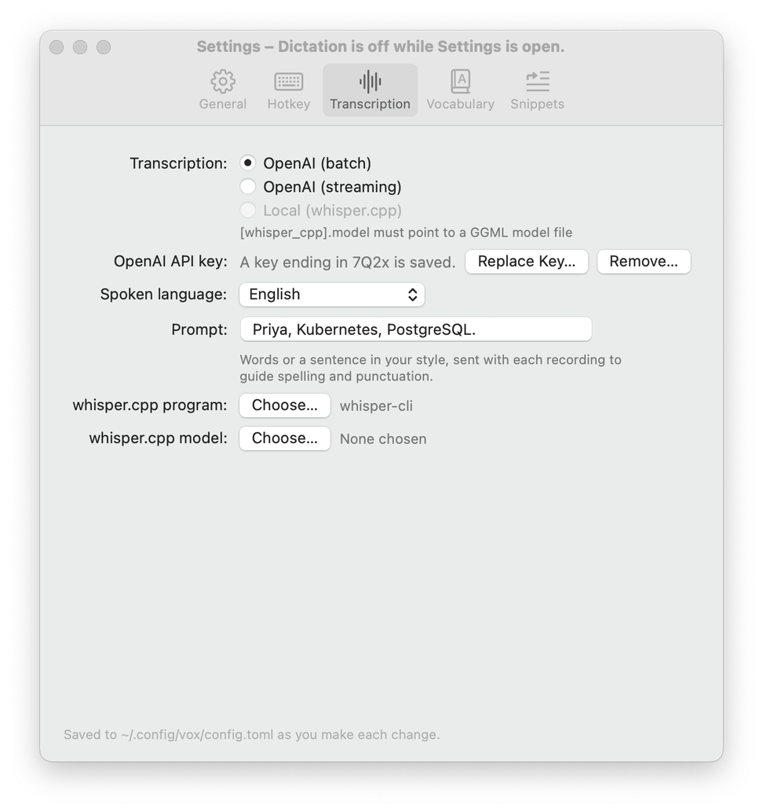
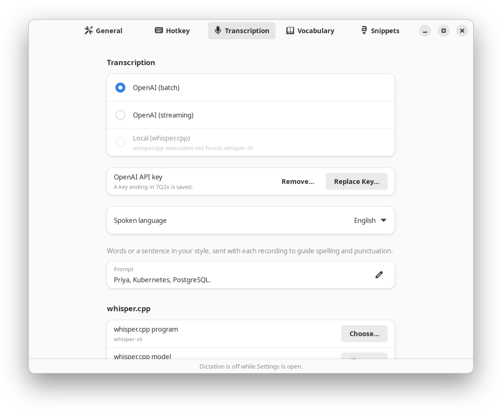
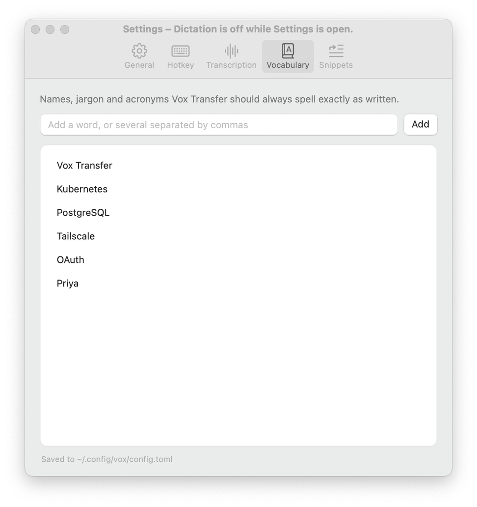
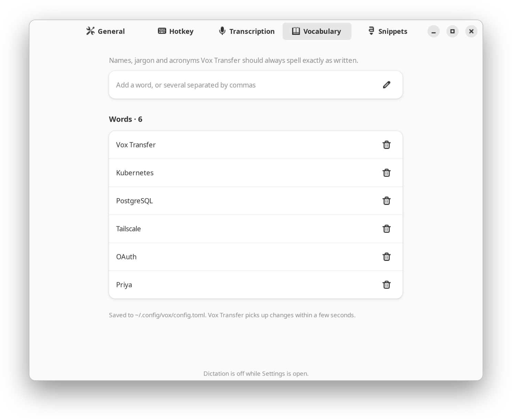
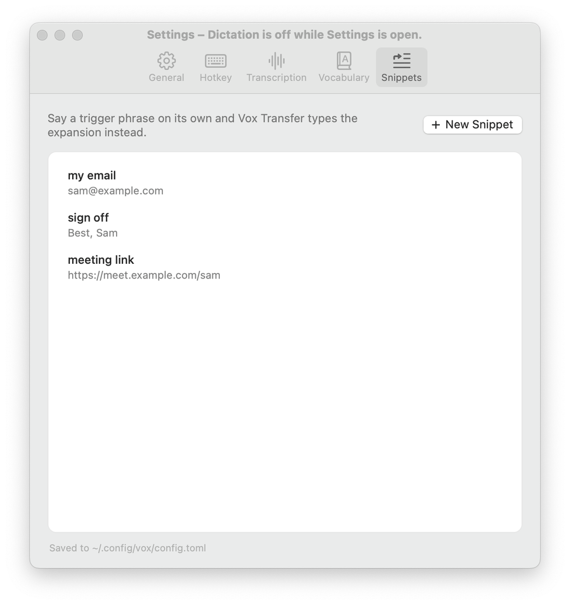
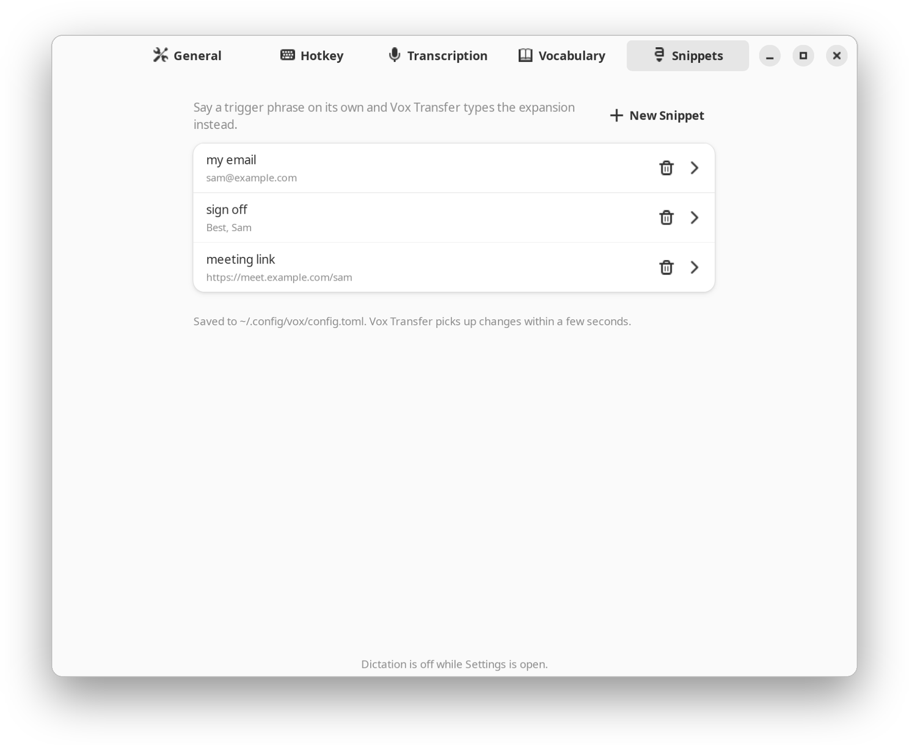

# Settings

[Back to the README](../README.md)

- [The Settings window](#the-settings-window)
- [The settings file](#the-settings-file)
- [All settings](#all-settings)
- [When the file has an error](#when-the-file-has-an-error)
- [Sounds](#sounds)
- [Local transcription with whisper.cpp](#local-transcription-with-whispercpp)

Most people never need the settings file: **Settings…** in the Vox Transfer menu changes almost
everything for you. Prefer to have it done for you? Ask your AI coding assistant to follow
[the setup guide for AI assistants](ai-setup.md).

## The Settings window

Choose **Settings…** from the menu while Vox Transfer is idle. Each change is saved to the settings
file as you make it, and applies once you close the window; the hotkey does not dictate while it is
open. The window reads the file again every few seconds, so an edit you make by hand shows there
too. [Using Vox Transfer](using.md#settings) says what each page does.

| Page | macOS | Linux |
| --- | --- | --- |
| General | <picture><source media="(prefers-color-scheme: dark)" srcset="images/settings-general-mac-dark.png"></picture> | <picture><source media="(prefers-color-scheme: dark)" srcset="images/settings-general-linux-dark.png"></picture> |
| Hotkey | <picture><source media="(prefers-color-scheme: dark)" srcset="images/settings-hotkey-mac-dark.png"></picture> | <picture><source media="(prefers-color-scheme: dark)" srcset="images/settings-hotkey-linux-dark.png"></picture> |
| Transcription | <picture><source media="(prefers-color-scheme: dark)" srcset="images/settings-transcription-mac-dark.png"></picture> | <picture><source media="(prefers-color-scheme: dark)" srcset="images/settings-transcription-linux-dark.png"></picture> |
| Vocabulary | <picture><source media="(prefers-color-scheme: dark)" srcset="images/settings-vocabulary-mac-dark.png"></picture> | <picture><source media="(prefers-color-scheme: dark)" srcset="images/settings-vocabulary-linux-dark.png"></picture> |
| Snippets | <picture><source media="(prefers-color-scheme: dark)" srcset="images/settings-snippets-mac-dark.png"></picture> | <picture><source media="(prefers-color-scheme: dark)" srcset="images/settings-snippets-linux-dark.png"></picture> |

A few settings are only in the file: `sample_rate`, `channels`, `double_tap_timeout_ms`,
`streaming_model`, `[whisper] model`, `[whisper_cpp] cpu_fallback` and `[window_classes]`. The window keeps them as they are.

## The settings file

Vox Transfer works without a settings file. To change a setting, create `~/.config/vox/config.toml`
(a commented copy of every setting is in [`config.example.toml`](../config.example.toml)).
Vox Transfer applies changes within a few seconds of a save, with no restart. Screen hints and the
recording limit apply from the next dictation, `[audio]` changes wait for a recording in progress to
end, and a new `[hotkey]` takes over at once, even during a recording, which the new key then stops.

A small example:

```toml
dictionary = ["Kubernetes", "PostgreSQL", "Priya"]

[hotkey]
key = "right_ctrl"

[transcription]
language = "en"

[snippets]
"my email" = "sam@example.com"
```

`dictionary` goes above the first `[section]`: in TOML, a line below a section header belongs to
that section.

## All settings

| Setting | Default | Meaning |
| --- | --- | --- |
| `dictionary` (top level) | `[]` | Words to spell exactly as written. |
| `[hotkey] key` | `"right_shift"` | The key to tap on its own: a modifier (`"right_shift"`, `"right_ctrl"`, `"right_alt"` or `"cmd_r"`, and `"shift"`, `"ctrl"`, `"alt"` or `"cmd"` for the left one), `"f1"` to `"f20"`, `"fn"` on macOS (the Globe key, also written `"globe"`), or `"pause"` or `"scroll_lock"` on Linux. The Hotkey page of Settings records it for you. |
| `[hotkey] fallback` | `""` (none) | An extra key combination that toggles dictation, such as `"ctrl+space"` (`ctrl` is the left Control key; `right_ctrl` the right one). |
| `[hotkey] double_tap_timeout_ms` | `400` | How fast a double-tap must be to cancel. |
| `[audio] device` | unset (system default) | Input device name or index, from `vox --list-devices`. The General page of Settings saves the name of the one you pick. |
| `[audio] sample_rate` | `48000` | Recording sample rate in Hz. |
| `[audio] channels` | `1` | Recording channels. |
| `[audio] max_recording_seconds` | `900` | The recording limit; a recording that reaches it stops and is transcribed. |
| `[transcription] mode` | `"batch"` | `"batch"`, `"streaming"` or `"whisper_cpp"`. |
| `[transcription] streaming_model` | `"gpt-live-transcribe"` | OpenAI model for streaming mode. |
| `[transcription] language` | unset (detect) | Spoken language as an ISO code, such as `"en"`. |
| `[transcription] prompt` | `""` | Text that primes the transcriber, in every mode. |
| `[whisper] model` | `"gpt-transcribe"` | OpenAI model for batch mode. |
| `[whisper_cpp] binary` | `"whisper-cli"` | The whisper.cpp command; a full path is safest. |
| `[whisper_cpp] model` | `""` | Path to a GGML model file; required for whisper.cpp mode. |
| `[whisper_cpp] cpu_fallback` | `true` | When the graphics card has no memory left for the model (a game is running, say), transcribe on the processor instead, more slowly. |
| `[context] screen` | `true` | Screen hints, see [Privacy](privacy.md#screen-hints-context-screen). |
| `[sounds] enabled` | `true` | Play sounds for start, stop, cancel and errors. |
| `[attenuation] enabled` | `true` | Lower the system volume while recording. |
| `[attenuation] level` | `0.5` | Recording volume as a fraction of the current volume. |
| `[snippets]` | none | `"trigger phrase" = "expansion"` pairs. |
| `[window_classes]` | none | `"part of window class" = "TERMINAL"` (or `EDITOR`, `CHAT`, `EMAIL`, `BROWSER`, `OTHER`). On Linux, terminals get Ctrl+Shift+V instead of Ctrl+V. |

Paths may be absolute, start with `~`, or be relative to the config file. `vox --config PATH` uses
another file. The OpenAI API key does not go in this file: set it on the Transcription page of
Settings.

## When the file has an error

If the file has an error when Vox Transfer starts (a typo, or a value of the wrong kind such as
`level = "0.5"`), Vox Transfer starts anyway but does not record: the menu shows **Settings file has
an error**, the log names the file and the setting, and the hotkey plays the error sound.
Vox Transfer does not fall back to defaults for dictation, since they might send audio to OpenAI
when you chose local transcription. Save a fixed file and Vox Transfer picks it up within a few
seconds. While the file has an error, Settings names the problem (in red on macOS, in a banner on
Linux) and changes nothing but the API key; once the file is fixed, it shows the fixed settings
within a few seconds. An error in an edit while
Vox Transfer is running is logged and ignored, and the previous settings stay in effect.

## Sounds

Vox Transfer plays a sound when dictation starts, stops, is cancelled or fails, when you press the
hotkey while it is busy or paused, and when you pause or resume. On macOS these are the system alert
sounds Tink, Pop, Basso, Funk, Blow, Bottle and Glass. On Linux Vox Transfer makes its own sounds that
resemble them: a quick high tick when dictation starts, a bubbly pop when it stops, a low honk for an
error, three plucked notes when it is busy, a soft swelling hum when you cancel, three falling knocks
when you pause and a glassy chime when you resume.

To use your own, put WAV files in `~/.config/vox/sounds`, named after the sound they replace:
`start.wav`, `stop.wav`, `cancel.wav`, `error.wav`, `busy.wav`, `pause.wav` and `resume.wav`.
Vox Transfer loads them when it starts; any it does not find keep the built-in sound.
`[sounds] enabled = false` turns all of them off.

## Local transcription with whisper.cpp

Transcribe on your own computer, with no API key and nothing sent anywhere.

1. Build whisper.cpp and download a model, in a checkout of
   [whisper.cpp](https://github.com/ggml-org/whisper.cpp):

   ```sh
   cmake -B build && cmake --build build -j --config Release
   sh ./models/download-ggml-model.sh large-v3-turbo
   ```

   On macOS, `brew install whisper-cpp` provides `whisper-cli` too; you still need a model file.

2. Point Vox Transfer at them: on the Transcription page of Settings, click **Choose…** next to
   the whisper.cpp program and the model. Or set them in `~/.config/vox/config.toml`:

   ```toml
   [whisper_cpp]
   binary = "~/whisper.cpp/build/bin/whisper-cli"
   model = "~/whisper.cpp/models/ggml-large-v3-turbo.bin"
   ```

   Give the full path to `whisper-cli`: the login service may not search the same `PATH` as your
   shell. On macOS it searches `/opt/homebrew/bin` and `/usr/local/bin` as well as the system
   folders.

3. Choose **Local (whisper.cpp)** on the Transcription page of Settings. Until both files work, it
   can't be chosen, and says what is missing.

If the whisper.cpp setup later breaks (a moved model, say), Vox Transfer still starts, shows the
problem in its menu, and lets you switch back to an OpenAI mode. Each hotkey press checks the setup
again before recording: while it is broken, Vox Transfer plays the error sound and records nothing,
and once you fix it, dictation works without restarting Vox Transfer. An edit to `[whisper_cpp]` or
the mode in `config.toml` updates the menu's first line within a few seconds.
